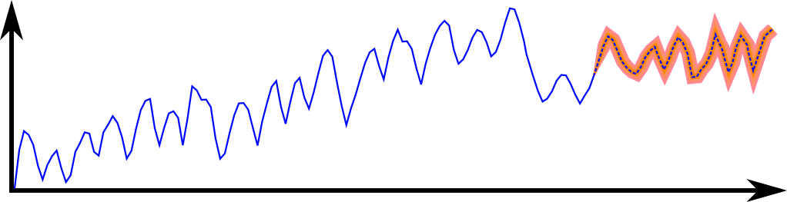

# Paper-2023-Hardware-implementation-nonstationary
This repository represents what was the working directory for the paper by Puja Chowdhury, Austin R. J. Downey, Jason D. Bakos, Simon Laflamme, and Chao Hu. Hardware implementation of nonstationary structural dynamics forecasting. In Serife Tol, Mostafa A. Nouh, Shima Shahab, Jinkyu Yang, and Guoliang Huang, editors, Active and Passive Smart Structures and Integrated Systems XVII. SPIE, apr 2023. doi:10.1117/12.2658036

## ⚠️ Important Note on Code Provenance

This repository was uploaded after the publication of the paper and reflects a working development directory used during the research process. This repository is shared to provide insight into the development process.

As a result:
- The code may not exactly reproduce the results presented in the paper  
- Some scripts or components may be experimental, deprecated, or incomplete  
- Additional files or artifacts may be present that were not used in the final publication  

## Licensing and Citation

This work is licensed under a Creative Commons Attribution-ShareAlike 4.0 International License [cc-by-sa 4.0].

