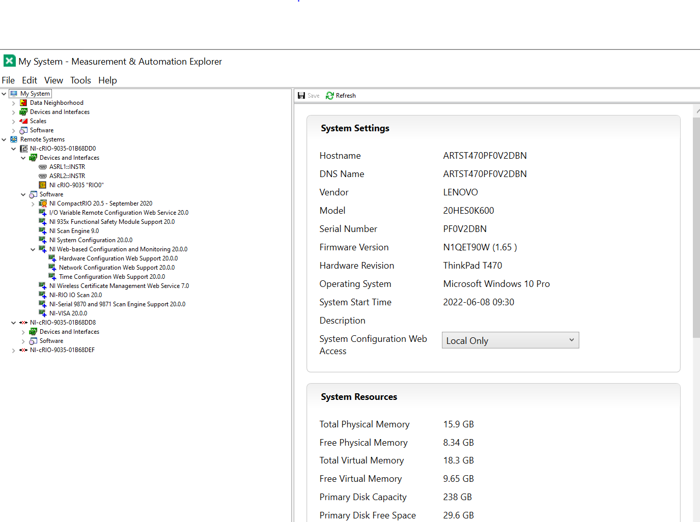

# FFT Hardware Implementation
## version
1. NIlabVIEW2020SP1
2. cRIO 9035 (1868DD0) Sofware installed 20.0 version.

## v1
FFT_based_prediction_only_labVIEW : FFT based prediction in labVIEW

## v2
FFT_prediction_v1: basic startup FFT based prediction in labVIEW FPGA

## v3
FFT_prediction_v2: basic startup FFT based prediction in labVIEW FPGA

## v4
FFT_prediction_v3:
* FFT based prediction in labVIEW FPGA.
* data send from host
* target named as FFT.vi used for FFT function. From FFT function real and imaginary value collected.
* compile successefully
* implementation on a cRIO-9035
* Trying to measure amplitude, spectrum in host.vi.

## v5
FFT_prediction_v5:
* FFT based prediction in labVIEW FPGA.
* data send from host
* target named as FFT.vi used for FFT function. From FFT function real and imaginary value collected.
* compile successefully
* implementation on a cRIO-9035
* Collecting real and imaginary value from target (using FIFO) and next steps of FFT based algorithum is in host.vi.

## v6
FFT_prediction_v6: 
* Puja's version of FFT in labVIEW FPGA.
* Gives real and imaginary numbers but real and imaginary array doesn't same.

## v7
FFT_prediction_v7:
* Dr Downey's FFT code with modification.
* send data from csv file
* FFT size (8 to 128) give real and imaginary values 
* But initially sending zero elements (zero padding size same as loop numbers)
## v7.1
FFT_prediction_v7:
* Same as V7
* each FIFO start with stacked sequence
* also add each FIFO configuration.
* real and imaginary array size still not same
* still zero padding happens.
## v8
FFT_prediction_v8:
* No single cycle time loop.​
* Execution Mode(FFT function): Outside single-cycle Timed loop​
* real and imaginary array size same as input size.
* no zero padding happens.
* FFT function works.
## v8.1
FFT_prediction_v8.1:
* FFT function same as v8.
* changes: find magnitude and phase and frequencies.
* working
## v8.2
FFT_prediction_v8.2:
* step 1: FFT function same as v8
* step 2: find magnitude, phase and frequency as v8.1
* new addition: collect specific frequencies.
* Still not working.
## v8.3
FFT_prediction_v8.3:
* include all steps of FFT based prediction
* restore signal is not an array (its only 18 points)

## v8.3.4
* Copy of v8.3, made by Austin Downey to look at the code. 

## Development Software
Below is a screen shot of the software setup on a development machine

